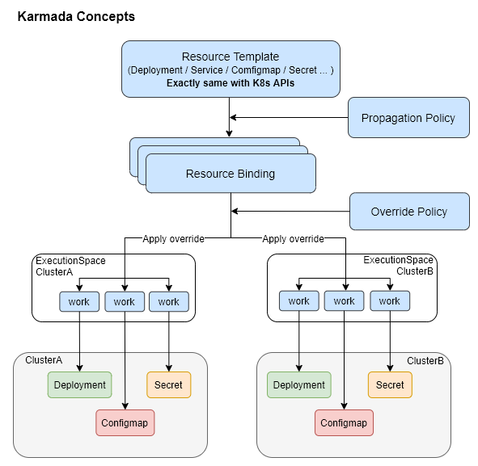

**Karmada Due Diligence**

Promotion to CNCF Incubation

**Authors:** Hongcai Ren

**TOC Sponsor(s):** Nikhita Raghunath

**Sponsor TAG:**  TAG-Runtime

- [**This Document**](#this-document)
- [**TAG Runtime Recommendation**](#tag-runtime-recommendation)
- [**Background**](#background)
- [**Project Goals**](#project-goals)
- [**About Karmada**](#about-karmada)
  - [**Core Concepts**](#core-concepts)
  - [**Features**](#features)
  - [**Current Status**](#current-status)
    - [**Community Growth**](#community-growth)
  - [**Future Plans**](#future-plans)
- [**Statement of CNCF Alignment to TOC Principles**](#statement-of-cncf-alignment-to-toc-principles)
  - [**CNCF Alignment to TOC Principles**](#cncf-alignment-to-toc-principles)
  - [**Value-add to the CNCF ecosystem**](#value-add-to-the-cncf-ecosystem)
  - [**Alignment with other CNCF projects**](#alignment-with-other-cncf-projects)
- [**Formal Acceptance Requirements**](#formal-acceptance-requirements)
- [**Other Considerations**](#other-considerations)
  - [**Clear project definition**](#clear-project-definition)
  - [**Project Code Quality and Fundamentals**](#project-code-quality-and-fundamentals)
    - [**CI/CD status**](#cicd-status)
  - [**Open Governance**](#open-governance)
  - [**Vendor Independence**](#vendor-independence)
  - [**Performance and scalability**](#performance-and-scalability)
- [**Adopter Interviews**](#adopter-interviews)
- [**Appendix**](#appendix)
  - [**License**](#license)
  - [**Code of Conduct**](#code-of-conduct)
  - [**Source control**](#source-control)
  - [**Devstats**](#devstats)

# **This Document**
The purpose of this document is to provide the Karmada project technical review Due Diligence [described here](https://github.com/cncf/toc/blob/master/process/dd-review-template.md). Its goal is to provide data to help the TOC to decide on accepting Karmada into CNCF Incubation status.
# **TAG Runtime Recommendation**
Based on the due diligence, the TAG can confirm that Karmada fulfills the formal criteria for incubation, subject to TOC user interviews to be performed. The project fills in gaps in several areas, including filling in the blanks of multi-cloud and multi-cluster Kubernetes orchestration, striving for better integration patterns, and working with the landscape projects in a well and close manner. It also applies and encourages the usage of cloud native principles. 

The project has seen substantial growth and development. The project is also constantly striving to increase its operational bar and community engagement (see more under “[Formal Acceptance Requirements](#Formal Acceptance Requirements)” and “[Other Considerations](#Other Considerations)”).
# **Background**
●     Link to TOC PR:[https://github.com/cncf/toc/pull/986](https://github.com/cncf/toc/pull/986)

●     Link to video/presentation: 

1. [Presentation](https://docs.google.com/presentation/d/1iLYQzG2uPFY-k4O2KsYOlPfXcbONLoSO/edit?usp=sharing&ouid=117704021223528167287&rtpof=true&sd=true)

●     Link to GitHub organization:[https://github.com/karmada-io/karmada](https://github.com/karmada-io/karmada)

●     Link to Website: [https://karmada.io/ ](https://karmada.io/)

●     Link to documentation:[https://karmada.io/docs/](https://karmada.io/docs/)
# **Project Goals**
Karmada (Kubernetes Armada) is a Kubernetes management system that enables you to run your cloud-native applications across multiple Kubernetes clusters and clouds, with no changes to your applications. By speaking Kubernetes-native APIs and providing advanced scheduling capabilities, Karmada enables truly open, multi-cloud Kubernetes.

Karmada aims to provide turnkey automation for multi-cluster application management in multi-cloud and hybrid cloud scenarios, with key features such as centralized multi-cloud management, high availability, failure recovery, and traffic scheduling.

Karmada provides default policy sets to ensure high application availability from multiple dimensions in different scenarios. Region-independent cluster management allows more flexible service deployment.

Karmada presents its value in the following two aspects:

1. Provides a smooth path for organizations to evolve from a single-cluster architecture to a multi-cloud one, while channeling the cloud native technology ecosystem to their native Kubernetes capabilities in use.
1. Provides functional modules covering HA scheduling, failover, multi-cluster service discovery, multi-cloud cluster lifecycle management, etc, as well as policy sets for a variety of scenarios, which allow users to customize their own multi-cloud platforms.
# **About Karmada**
Karmada is a Kubernetes management system that enables you to run your cloud-native applications across multiple Kubernetes clusters and clouds, with no changes to your applications. 

Karmada focuses on solving challenges resolved for multi-cloud and multi-cluster:

1. **Numerous clusters**
- Complex and repeated cluster configurations
- Cluster management varies from vendor to vendor
- Fragmented API access entries
2. **Scattered services**
- Application configuration differs across clusters
- Cross-cloud service access
- Application synchronization between clusters
3. **Restrictions from clusters**
- Restricted resource scheduling
- Restricted application availability
- Restricted auto scaling
4. **Vendor lock-in**
- Service deployment dependency
- Lack of automatic failover
- Lack of neutral open-source
- multi-cluster orchestration projects

A complete and working Karmada control plane consists of several components:

- karmada-apiserver exposes the Karmada API in addition to Kubernetes.
- karmada-scheduler is responsible for scheduling resources to clusters.
- karmada-controller-manager runs various custom controller process.
- etcd used as backing store for API resources.
- karmada-agent takes the responsibility for a specific cluster to syncing configurations from control plane.

For the more detail description of each Karmada control plane components, please refer to [Control Plane Components](https://karmada.io/docs/next/core-concepts/components).

## **Core Concepts**
For above goals, Karmada provides some core concepts.

1. Resource Template
- Same as native Kubernetes API definitions, including CRDs
- Used to create multi-cluster applications without modification
2. Propagation Policy
- Widely applicable policy for multi-cluster application scheduling
3. Resource Binding
- Unified abstraction, which drives internal processes
4. Override Policy
- Differentiated configuration policy applicable across clusters
5. Work
- Object at the federation layer to present a resource in a sub-cluster 

## **Features**
Karmada currently has the following key features.

- **Compatible with Kubernetes native APIs:** Unlike Kubefed, Karmada supports Kubernetes native APIs. Users can not only upgrade from single-cluster to multi-cluster deployments without code refactoring but also seamlessly integrate with the Kubernetes single-cluster tool chain. 
- **Cross-cloud, multi-cluster, multi-mode management:** Karmada supports multi-mode cluster management. Users can manage clusters in various public cloud vendors, private cloud and edge side.
- **Various multi-cluster scheduling policies:** like K8s, Karmada supports different scheduling policies. Users can schedule applications to specific clusters based on cluster affinity, toleration and other strategies. Based on this, users can realize multi-cluster HA deployment across regions, AZs, clusters and vendors. Users can also configure policies to resolve the differences of the same application in different clusters.
- **Multi-cluster Failover:** Karmada supports users to set distribution policies, and automatically migrates the faulty cluster replicas in a centralized or decentralized manner after a cluster failure or an application failure.
- **Global Uniform Resource View:** Karmada provides a global uniform resource view. Users can collect and aggregate status into resource templates with the help of Resource Interpret Framework. Moreover, users can manage resources and perform O&M operations in a unified manner on the control plane.
- **Cross-cluster service governance:** Karmada supports multi-cluster service discovery by leveraging [MCS-API](https://github.com/kubernetes-sigs/mcs-api) and multi-cluster network by working with [Submariner](https://github.com/submariner-io/submariner).
## **Current Status**
Karmada once released new features every month. Starting from version 1.0.0 on Dec 31 in 2021, we changed our pace to every 3 months, with the aim to deliver more stable features and smooth upgrades. The biggest accomplishment of the community for the past year is the release of v1.0.0, the first milestone for the project, which means Karmada is now stable and ready to be used in production environments. Karmada has been validated by project adopters successfully running Karmada in their own prod. Future enhancements and improvements are intended to be done in a backwards compatible way with a clear upgrade path. We do not anticipate any further breaking changes in subsequent minor and patch releases.

With Karmada reaching maturity, more and more users adopt Karmada as the core to build their multi-cloud and multi-cluster container orchestration engine for higher service efficiency. The community is witnessing promising growth. Some [success cases](#Formal Acceptance Requirements) set a good example for future adopters.

### **Community Growth**
We joined hands with end users across industries and witnessed successful implementations of Karmada in many real-world projects. We have built channels to reach out to our users to know better what they want and need, such as meetups and online activities. Also, we continue to refine our documentation and use cases so that our users can get started with our project faster.

Before our journey of developing Karmada, we were deeply engaged in the KubeFed project led by the Kubernetes multi-cluster SIG. Such engagement brought us insights and expertise to develop Karmada. Karmada is built based on Kubernetes Federation v1 and v2 and inherits some basic concepts from them. We also marked our presence in upstream communities.

- In the Kubernetes community, we led the design of the [work API](https://github.com/kubernetes-sigs/work-api) for multi-cluster deployments. Our contributions make us the [maintainers of this project](https://github.com/kubernetes-sigs/work-api/blob/master/OWNERS). Meanwhile, we are actively involved in the [mcs-api](https://github.com/kubernetes-sigs/mcs-api) and [about-api](https://github.com/kubernetes-sigs/about-api) projects hosted by Kubernetes multi-cluster SIG. We are also one of the earliest projects to adopt the above APIs of the upstream communities. Our users can easily use them in Karmada. For example, we provide [multi-cluster service discovery](https://karmada.io/docs/next/userguide/service/multi-cluster-service) based on multi-cluster service APIs.
- Besides Kubernetes, we are open to integration of more CNCF projects and already have some amazing cases (details available [here](#Alignment with other CNCF projects)).

The above efforts take the community to a new height since the project entered the CNCF sandbox. Numbers can tell the story.

Karmada currently has [490+](https://karmada.devstats.cncf.io/d/18/overall-project-statistics-table?orgId=1&viewPanel=1) contributors from [60+](https://karmada.devstats.cncf.io/d/5/companies-table?orgId=1) organizations and [19](https://karmada.devstats.cncf.io/d/18/overall-project-statistics-table?orgId=1&viewPanel=1) countries and regions. 

- We hold bi-weekly community meetings regularly (60+ times as of August 2023), with about 25 attendees each time. [Meeting minutes](https://docs.google.com/document/d/1y6YLVC-v7cmVAdbjedoyR5WL0-q45DBRXTvz5_I7bkA/edit).
- [GitHub stars](https://karmada.devstats.cncf.io/d/3/stars-and-forks-by-repository?orgId=1) increased from 1,600+ to 3,400+
- [GitHub forks](https://karmada.devstats.cncf.io/d/3/stars-and-forks-by-repository?orgId=1) increased from 200+ to 700+
- [Number of contributions](https://karmada.devstats.cncf.io/d/74/contributions-chart?orgId=1&var-period=m&var-metric=contributions&var-repogroup_name=All&var-country_name=All&var-company_name=All&var-company=all&from=now-1y&to=now&editPanel=5) increased to 1,500+ per month
- [Number of new PRs](https://karmada.devstats.cncf.io/d/15/new-prs-in-repository-groups?orgId=1&editPanel=1) increased to 30+ per week
- Number of commits increased from 300+ to 1,500+
- Number of PR reviewers increased to 100+

Specific devStats can be found at: [https://karmada.devstats.cncf.io/d/8/dashboards?orgId=1&refresh=15m](https://karmada.devstats.cncf.io/d/8/dashboards?orgId=1&refresh=15m).
## **Future Plans**
The Karmada project continues to grow and has its sight on short-term and long-term goals:

- Multi-cluster security. Multi-cluster security presents many challenges.
  - Karmada manages clusters centrally, which eases cluster management but brings some security risks. The aim is to minimize the permissions of the control plane and reduce blast radius to member clusters after a control plane failure.
  - Another target is on multi-cluster access control with finer-grained security isolation on the control plane.
- Larger scale landing. We have started early on improving user experience in large-scale scenarios in the past releases. Multicloud means larger resource pools, which brings greater performance pressure to the multi-cloud management platform. In large-scale scenarios, we will continue to reduce the access latency, resources consumed, and stability impact on the system under high concurrency.
- Multi-cluster observability. Multi-cluster observability is an important part in a multi-cluster orchestration.
  - We will continue to explore integrated solutions for multi-cloud monitoring and logging.
  - We will continue to optimize multi-cluster events so that users can better maintain the multi-cloud management platform.
- Multi-cluster application distribution. There are still many challenges in application distribution across multiple clusters.
  - For plug-ins coupled with the cluster, we will dive into simplifying the plug-in installation and lifecycle management.
  - When applications have sequential relationships between clusters, we aim to provide a multi-cluster workflow to simplify the deployment of these applications.
- Integration with the ecosystem. The integration with the CNCF ecosystem has always been a major focus of our efforts. We believe that cooperation in different fields can better serve our users. We will continue to seek cooperation with other mature projects to form an open and prosperous ecosystem.

The planned new features are listed in the [roadmap](https://github.com/karmada-io/karmada/blob/master/ROADMAP.md).
# **Statement of CNCF Alignment to TOC Principles**
## **CNCF Alignment to TOC Principles**
**Project is self-governing.**     

Karmada is self-governing. 

We attach great importance to developers. We have established [community membership](https://github.com/karmada-io/community/blob/main/community-membership.md) and written a solid [contributor guide](https://github.com/karmada-io/community/blob/main/CONTRIBUTING.md). Based on this open and transparent mechanism, developers can continue to grow while equally participating in the project. 

Karmada using OWNERS file to designate responsibility over different parts of the codebase. Karmada now has [30+ reviewers](https://github.com/karmada-io/community/blob/main/REVIEWERS.md) who are able to review code for quality and correctness on some part of the project and [20+ approvers](https://github.com/karmada-io/community/blob/main/APPROVERS.md) who are able to accept contributions. The approvers are from about 10+ companies.

Below is a list of people who are [maintainers](https://github.com/karmada-io/community/blob/main/community-membership.md#maintainer) of the Karmada community. The list of maintainers is defined [here](https://github.com/karmada-io/karmada/blob/master/MAINTAINERS.md).

|Maintainer|GitHub ID|Affilation|
| :- | :- | :- |
|Hanbo Li|@mrlihanbo|ByteDance|
|Hongcai Ren|@RainbowMango	|Huawei|
|Kevin Wang|@kevin-wangzefeng	|Huawei|
|Lei Xue|@carmark|Moore Threads|
|Shiyi Xie|@GitHubxsy|Huawei|
|Yifan Shen|@zoroyouxi|ICBC|
|Yiheng Ci|@lfbear|VIPKID|

**Is there a documented Code of Conduct that adheres to the CNCF guidelines?**

Yes. See [https://github.com/karmada-io/karmada/blob/master/CODE_OF_CONDUCT.md](https://github.com/karmada-io/karmada/blob/master/CODE_OF_CONDUCT.md).

Karmada follows the CNCF Code of Conduct.

**Does the project have production deployments that are high quality and high-velocity? (for incubation and graduated projects)**  

Yes. See [project adoption](#Formal Acceptance Requirements) section below.

**Is the project committed to achieving the CNCF principles and do they have a committed roadmap to address any areas of concern raised by the community?** 

Yes. See [https://github.com/karmada-io/karmada/blob/master/ROADMAP.md](https://github.com/karmada-io/karmada/blob/master/ROADMAP.md).
## **Value-add to the CNCF ecosystem**
As surveyed, more than 93% of enterprises are using the services of multiple cloud vendors at the same time. Cloud native technologies and the cloud market continue to mature. Multi-cloud and multi-cluster deployments become the choice of the future. Karmada aims to provide turnkey automation for multi-cluster application management in multi-cloud and hybrid cloud scenarios, with key features such as centralized multi-cloud management, high availability, failure recovery, and traffic scheduling. With Karmada, users can not only evolve from a single-cluster architecture to a multi-cloud one smoothly, but also customize their own multi-cloud platforms with a variety of policy sets.

As CNCF’s first multi-cluster project, Karmada strictly aligns with the mission of CNCF in empowering organizations to build and run applications in modern cloud native environments and benefit from the evolving cloud native technologies.
## **Alignment with other CNCF projects**
**Does the project align and actively collaborate with other CNCF projects.**

Karmada is developed in continuation of Kubernetes [Federation v1](https://github.com/kubernetes-retired/federation) and [v2](https://github.com/kubernetes-sigs/kubefed). In the past few years, Karmada actively cooperates with other CNCF projects and helps them better transition to multi-cluster based on K8s native APIs.

The following lists ecosystem projects integrated with Karmada:

- [Argo CD](https://karmada.io/docs/userguide/cicd/working-with-argocd), a CNCF incubating project, makes for a very powerful combination with Karmada to manage workloads across clusters and simplify the delivery of multi-cloud applications, further extending the self-service infrastructure capabilities.
- [Flux](https://fluxcd.io/flux/use-cases/karmada/), the CNCF CI/CD project, partnered with Karmada to support Helm chart propagation and customization across clusters among multiple regions and multiple vendors.
- [Kyverno](https://karmada.io/docs/userguide/security-governance/working-with-kyverno), a CNCF incubating project, works alongside Karmada to unify management of security policies for multiple clusters. With Karmada, users do not have to tediously configure security policies in member clusters. [The discussions](https://github.com/kyverno/kyverno/discussions/4282) we initiated in the kyverno community also provided a new way of thinking for kyverno to manage multi-cluster security policies.
- [Velero](https://karmada.io/docs/administrator/backup/working-with-velero), which provides the ability to backup and migrate Kubernetes resource and persistent volumes, can utilize Karmada to implement the unified backup and recovery of resources across multiple clusters. We are glad that AIML INSTITUTE used this solution in production.
- [Istio](https://karmada.io/docs/userguide/service/working-with-istio-on-flat-network), the CNCF service mesh project, can utilize Karmada to implement multi-cluster traffic governance in both flat and non-flat network planes.
- In terms of multi-cluster observability, Karmada works with [Prometheus](https://karmada.io/docs/administrator/monitoring/working-with-prometheus) to build a multi-cloud unified monitoring view. And [Filebeat](https://karmada.io/docs/administrator/monitoring/working-with-filebeat), which provides the ability to collect logs, can utilize Karmada to implement unified log collection in multi-cloud scenarios.
- [Submariner](https://karmada.io/docs/next/userguide/network/working-with-submariner), which provides the ability to flatten the network between clusters, works alongside with Karmada to provide the capabilities of application management and service discovery in the upper layer of the multi-cluster network.
- Besides the above, we also integrate with [OPA(gatekeeper)](https://karmada.io/docs/next/userguide/security-governance/working-with-gatekeeper), Thanos and so on.
# **Formal Acceptance Requirements**
**Document that it is being used successfully in production by at least three independent end users which, in the TOC’s judgement, are of adequate quality and scope.** 

18 adopters are using Karmada in their production environments as of July 1, 2023. The full adopter list can be found on our [website](https://karmada.io/adopters/).

Highlighted examples include:

[VIPKID](https://www.vipkid.com/): Uses Karmada to build a multi-cloud, multi-vendor PaaS platform across regions. The use case details can be found [here](https://karmada.io/docs/next/casestudies/vipkid).

[ICBC](http://www.icbc.com.cn/ICBC/EN/): Uses Karmada to build a multi-cloud platform to manage 100 Kubernetes clusters and more than 280,000 containers. The use case details can be found [here](https://karmada.io/zh/blog/2022/03/22/multi-cluster-management-with-an-ocean-of-nodes/).

[Vivo](https://www.vivo.com/): Builds a more resilient and elastic hybrid-multi-cloud platform using Karmada.

[Trip.com](https://www.trip.com/): Uses Karmada to build a multi-cloud platform with cross-cluster auto scaling and scheduling.

[Hurricane Engines](https://orang.cloud/): The ORANG low-code platform provides the service for users to build powerful applications quickly with zero lines of code. ORANG uses Karmada to deploy applications across multi-cloud. The use case details can be found [here](https://karmada.io/docs/next/casestudies/ci123).

[Huawei Cloud](https://www.huaweicloud.com/intl/en-us/): Huawei Cloud's UCS (Ubiquitous Cloud Native Service) adopts Karmada to connect and manage cross-cloud and cross-region clusters and the cloud native applications running in them. UCS provides consistent experience in cloud native deployment, management, and application ecosystem. The use case details can be found [here](https://support.huaweicloud.com/intl/en-us/productdesc-ucs/ucs_productdesc_0001.html).

[DaoCloud](https://www.daocloud.io): DaoCloud's MultiCloud Management platform (Kairship), is a robust and user-friendly solution for orchestration of multi-cloud applications. It is built on Karmada, an open-source technology. Kairship provides centralized management for multiple clouds and hybrid clouds, giving users the ability to easily deploy, release, and operate applications across different cloud environments. For use case details can be found [here](https://docs.daocloud.io/videos/kairship.html).

**Have a healthy number of committers. A committer is defined as someone with the commit bit; i.e., someone who can accept contributions to some or all of the project.**

In the past year, Karmada expanded to 330+ contributors from 50+ different organizations, including end users,cloud vendors, academic institutions and individual developers, showing the good diversity of the community.

There are 70 project members for Karmada, out of which there are 7 [maintainers](https://github.com/karmada-io/karmada/blob/master/MAINTAINERS.md), 23 [approvers/reviewers](https://github.com/karmada-io/community/blob/main/REVIEWERS.md) from 15 different organizations.

**Demonstrate a substantial ongoing flow of commits and merged contributions.**

A short summary has been provided in [Community Growth](#Community Growth). Detailed statistics can be found in the following devstats links:

- [Contribution Activity](https://karmada.devstats.cncf.io/d/74/contributions-chart?orgId=1&from=now-1y&to=now): 1700+ per month
- [New contributors since sandbox](https://karmada.devstats.cncf.io/d/52/new-contributors-table?orgId=1&from=1631635200000&to=now)
- [Issues open/closed since sandbox](https://karmada.devstats.cncf.io/d/12/issues-opened-closed-by-repository-group?orgId=1&from=1631635200000&to=now): average 45 issues opened and 35 issues closed per month
- [PRs open/closed since sandbox](https://karmada.devstats.cncf.io/d/12/issues-opened-closed-by-repository-group?orgId=1&from=1631635200000&to=now): average 127 PRs opened and 115 PRs closed per month
- [Contributing organizations](https://karmada.devstats.cncf.io/d/5/companies-table?orgId=1): 60+ companies and organizations

**A clear versioning scheme.**

Karmada uses the [semantic versioning scheme](https://semver.org/#semantic-versioning-specification-semver). We have minor releases every three months, for patch releases the cadence is roughly one month, or when critical fixes are required. The latest release is v1.6.2.

We have releases documented at: [https://karmada.io/docs/next/releases](https://karmada.io/docs/next/releases) and [https://karmada.io/docs/next/developers/releasing](https://karmada.io/docs/next/developers/releasing).

**Clearly documented security processes explaining how to report security issues to the project, and describing how the project provides updated releases or patches to resolve security vulnerabilities**

Karmada has a responsible and mature vulnerability submission and disclosure program, managed by the Karmada Security Team. The processes are documented at [https://github.com/karmada-io/community/blob/main/security-team/SECURITY.md](https://github.com/karmada-io/community/blob/main/security-team/SECURITY.md).

Karmada using [DCO ](https://developercertificate.org/)to certify all contributions, and contributions are accepted by [PR process](https://karmada.io/docs/next/contributor/github-workflow/), all [members](https://github.com/karmada-io/community/blob/main/community-membership.md#member) are required to enable [two-factor authentication](https://help.github.com/articles/about-two-factor-authentication) on their GitHub account. In order to restrict access to admin level functionality in GitHub functionality, Karmada admin team are now only two people: [Chris Aniszczyk](https://github.com/caniszczyk) and [Kevin Wang](https://github.com/kevin-wangzefeng). In addition, the administrator has no decision making power on its own, but is instead there to serve the needs of the maintainers and contributors.
# **Other Considerations**
## **Clear project definition**
**Does the project have a clear and well defined scope**

Karmada’s scope is defined on its project website and on the docs intro page:

- Website: [https://karmada.io/](https://karmada.io/)
- Documentation: [https://karmada.io/docs/](https://karmada.io/docs/)
## **Project Code Quality and Fundamentals**
**Are there any metrics around code quality?  Are there good examples of code reviews? Are there enforced coding standards?**

Karmada makes use of several tools to ensure high code quality, including [Go Report](https://goreportcard.com/report/github.com/karmada-io/karmada), [CodeCov](https://app.codecov.io/gh/karmada-io/karmada), [CI workflow](https://github.com/karmada-io/karmada/tree/master/.github/workflows), Go Linter, Prow and others.  The following is some of the statistics.

Ratings:

- OpenSSL Best Practices: [Passing](https://bestpractices.coreinfrastructure.org/zh-CN/projects/5301)
- Go Report: [A+](https://goreportcard.com/report/github.com/karmada-io/karmada)

Each code change needs to get a /lgtm and a /approve to merge, usually there is at least one or two Approver’s Approval based on a code review. When PR meets the merge standard(necessary tests pass, have /lgtm, /approve label), Prow bot will automatically merge the PR.

For each PR, the CI process is triggered including checks with CodeCov to check code testing coverage and e2e testing to make sure that the merged code will not affect the existing functions.

For a feature that needs significant effort, or changes Karmada in a significant way, we should firstly submit a Proposal PR [here](https://github.com/karmada-io/karmada/tree/master/docs/proposals), to let more maintainers, developers and users discuss it in the PR or community meeting.

Some examples for pull requests in Karmada which highlight the integration with automated code quality checks as well as code reviews by the Karmada maintainers.

- PR-3181: [https://github.com/karmada-io/karmada/pull/3181](https://github.com/karmada-io/karmada/pull/3181)
- PR-3201: [https://github.com/karmada-io/karmada/pull/3201](https://github.com/karmada-io/karmada/pull/3201)
- PR-3099: [https://github.com/karmada-io/karmada/pull/3099](https://github.com/karmada-io/karmada/pull/3099)

To help new contributors getting started with contributing to Karmada, Karmada provides complete contributor [guides](https://karmada.io/docs/contributor/github-workflow) that give recommendations for details about code contribution and management.
### **CI/CD status**
**Unit tests**

There are unit tests present in almost all packages of Karmada, they will be tested for each PR and code coverage will be calculated automatically with [CodeCov](https://app.codecov.io/gh/karmada-io/karmada). Currently the coverage is almost 50%.

**End-to-end tests**

There are end-to-end tests for most of the core functions including 130+ cases. Meanwhile, e2e tests cover all major versions of Kubernetes, from v1.21 to v1.27.

The following is a specific example: [https://github.com/karmada-io/karmada/actions/runs/4299292310](https://github.com/karmada-io/karmada/actions/runs/4299292310)

Each e2e test organized by [Ginkgo](https://github.com/onsi/ginkgo) will be runned in several Kubernetes clusters created by KinD on the GitHub action instance. 
## **Open Governance**
**How are committers chosen? How are architectural and roadmap decisions made? How many decision makers are outside the sponsoring organization.**

Karmada implements the open and vendor neutral governance model where the key decisions are made via open conversation and consensus in the Karmada community channels (GitHub, Wechat Group and Slack). Currently, the project does not have a dedicated governing board, and a group of [maintainers](https://github.com/karmada-io/community/blob/main/community-membership.md#maintainer) is a top [decision making body](https://github.com/karmada-io/karmada/blob/master/MAINTAINERS.md).

Karmada has established community membership. New Karmada contributors first enter the level of Reviewer members, before they get promoted to Approvers, and [eventually Maintainers of the project](https://github.com/karmada-io/karmada/pull/3756). Currently, all maintainers are from four different organizations. Our membership definition allows members/approvers to become maintainers by following the guidelines and satisfying the requirements. 

Roadmap decisions for the project and the community are made by a consensus in the community. The project’s public roadmap is listed [here](https://github.com/karmada-io/karmada/blob/master/ROADMAP.md), and any community member can suggest the roadmap update, like [here](https://github.com/karmada-io/karmada/pull/1751).
## **Vendor Independence**
**Is the project reasonably independent from the sponsoring vendor? Are all communication channels and project resources hosted just for this project or with other CNCF projects/resources? Is all code that is part of the project hosted and part of the CNCF managed orgs and repos?  Are all defaults for upstream reporting either unset or community hosted infrastructure (i.e. doesn’t point to vendor hosted SaaS control plane or analytics server for usage data)? Is all project naming independent of vendors?** 

Karmada was jointly initiated by multiple organizations including [ICBC](https://www.icbc.com.cn/en/column/1438058319784067131.html), [SPD Bank](https://eng.spdb.com.cn/), [xiaohongshu.com](https://www.xiaohongshu.com/), [VIPKid.com](https://www.vipkid.com/en-us/), [Huawei Cloud](https://www.huaweicloud.com/), [Qutoutiao.com](http://qutoutiao.net/), [First Automobile Works](http://www.faw.com/), and [T3go.cn](https://www.t3go.cn/), now has transferred ownership to the CNCF, and set the CNCF as an owner on the following infrastructure, communication channels, and project resources as part of Sandbox acceptance:

- Entire [GitHub organization](https://github.com/enterprises/cncf?query=karmada-io), where all project code, website, documentation, project planning, and builds are hosted
- Trademark
- Domain ownership of [karmada.io](https://karmada.io/)
- Slack workspace: [https://cloud-native.slack.com/archives/C02MUF8QXUN](https://cloud-native.slack.com/archives/C02MUF8QXUN)

The following resources are also available to have ownership granted to the CNCF immediately:

- Dockerhub organization
- Twitter account

Karmada is using [Prow](https://docs.prow.k8s.io/docs/overview/) to provide GitHub automation in the form of policy enforcement, chat-ops via /foo style commands, and automatic PR merging. Prow is now hosted on a separate Kubernetes cluster sponsored by Huawei Cloud. 

## **Performance and scalability**
The popularity of Karmada is now drawing users' attention to Karmada's scalability and deployment at scale. Therefore, we launched a large-scale test on Karmada to obtain baseline performance metrics for Karmada managing multiple Kubernetes clusters. For multi-cluster systems represented by Karmada, the size of a single cluster is not a limiting factor restricting the scalability. On that account, we referred to the standard configurations of Kubernetes large-scale clusters and real-world implementations, and tested Karmada on managing 100 Kubernetes clusters (each cluster containing 5k nodes and 20k pods) at the same time. Limited by the environment and tooling, this test is not designed for stress testing Karmada, but for using Karmada in typical multi-cluster scenarios in production. The test results show that **Karmada can stably support 100 large-scale clusters with 500,000 nodes connected at the same time, running more than 2 million pods.**

The complete test report is listed [here](https://karmada.io/blog/2022/10/26/test-report).
# **Adopter Interviews**
The following section mentions feedback from certain adopters. This includes both end users and vendors.

**Motivation**

*“Compared to other products in the same space, both proprietary and open-source, what attracted us to the Karmada project was primarily our previous experience with Kubefed as a multi-cluster management solution. We found that Kubefed's API definitions were not as user-friendly and transparent as we had hoped. However, when we discovered Karmada, we were impressed by its more user-friendly multi-cluster API. In addition, Karmada demonstrated superior scalability, including its APIs, schedulers, and orchestration controllers, making it a more compelling choice for us.”*

*“What we admire most is that customers' existing applications can be transformed into multi-cluster applications without transformation costs, and the scheduling model is extended through K8s CRD instead of reinventing the federated application model. Also, rich scheduling strategies to adapt to different scenarios of customers (multi-region, AZ) and*

*Intelligent failover of applications across clusters.”*

*“We needed a federation layer to manage our K8s clusters in different regions and zones across 3 main public cloud providers and private cloud so that the platform engineers can access these clusters through a single endpoint.*

*We really expect the federation to be compatible with Kubernetes native api. Karmada meets the requirement very well so that we can migrate workloads to federation very easily.*

*We really expect the federation can decouple the concerns of the end users and platform engineers. Karmada abstracts these concerns to different CRDs(such as PropogationPolicy and ResourceTemplate), unlike kubefedv2 mixed them in the same CR.”*

**Adoption Experience**

*“Thanks to the compatibility with Kubernetes native API, we migrate workloads to it smoothly. We design and implement our own federated workload controller for customized complicated workloads by using the framework provided by the Karmada community easily.”*

*“The biggest challenge for us is the performance and reliability to fit Karmada to our production at a scale of more than 10k Apps and 300k Pods. Normally we will profile it, test it and then improve it by ourselves first. Then we will discuss these problems with the community and submit PR to the upstream sometimes.”*

**Measurable improvements**

*“Karmada helps us elevate the packing rate of clusters by about 30%. In the past, since we don’t have a multi-cluster management system and don’t know how to schedule our workloads dynamically across different clusters, it often happened that some clusters were empty and some other ones were very busy. After my implementation, now we don't suffer from this any more, our packing rate increased and all workloads could run as long as we have enough resources.”*

*“It has helped us in the following ways:*

1. *Increased Reliability: Karmada has helped us manage over 50 clusters and orchestrate more than 2000 stateless applications across those clusters. This has significantly improved the reliability of our infrastructure and ensured smoother operations.*
1. *Enhanced Availability: Karmada, in conjunction with Velero, has enabled us to quickly recover from cluster failures. The combination of these tools has increased the availability of our applications, minimizing downtime and ensuring uninterrupted service for our users.*
1. *Improved Migration Efficiency: With Karmada's API, we have achieved efficient workload migration between clusters. This has allowed us to easily schedule and distribute workloads across different clusters, making the migration process faster and more streamlined.”*

**Contributions from End Users**

*“We have been using Karmada for 2 years starting with v0.7.0. We deployed Karmada in our production environment and made a lot of contributions to Karmada according to our own production experience.”*

“*We use Kamrada as a workload and cluster management system. All of our workloads, like AI training Jobs or some computing applications, are all submitted to the Karmada control plane. Our Kubernetes clusters are registered to this control plane and we define a lot of default propagation policy to schedule different workloads.*

*Firstly we realized that Karmada does not have a strong scheduling capability to meet our own demand. Some workloads cannot be divided into clusters dynamically based on their available resources. So we decided to make our own contributions and now Karmada does have a more powerful scheduling capability.”*

**Maintainer Diversity**

*“Now maintainers come from [4 different companies](https://github.com/karmada-io/karmada/blob/master/MAINTAINERS.md). I'm glad to see more maintainers from other companies here”*

**Potential Improvements for the Future**

*“In the future, we hope Karmada can provide more support for multi-cluster statefulsets, and we plan to work with the community to improve this part.”*

*“Nourish more reviewers and activate more scenarios. For example, the scheduler does not have a great capability for offline workloads like AI training jobs or big data jobs so far. I think it still has a long way to go.”*
# **Appendix**
## **License**
Apache2.0.
## **Code of Conduct**
[https://github.com/karmada-io/karmada/blob/master/CODE_OF_CONDUCT.md](https://github.com/karmada-io/karmada/blob/master/CODE_OF_CONDUCT.md.)
## **Source control**
Karmada is a GitHub organization with several repos. GitHub: [https://github.com/karmada-io ](https://github.com/karmada-io)
## **Devstats**
[https://karmada.devstats.cncf.io/d/8/dashboards?orgId=1&refresh=15m](https://karmada.devstats.cncf.io/d/8/dashboards?orgId=1&refresh=15m)

