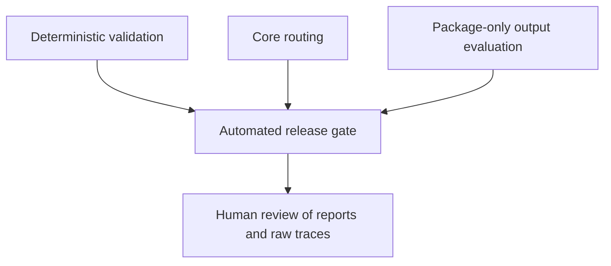

# Karmada Agent Skills Evaluation

This directory contains all non-runtime material used to develop and evaluate the seven Karmada
skills. Nothing under `evals/` is installed with a runtime skill.

## Evaluation model



| Surface | Question answered |
| --- | --- |
| Deterministic | Are packages, cases, scenarios, and helper contracts structurally valid? |
| Trigger corpus | Should one named skill activate for a positive or near-miss request? |
| Core routing | Does a request select the correct Karmada skill and avoid adjacent skills? |
| Output evaluation | Does an explicitly selected skill produce useful, correct, and safe package-only output? |
| Release gate | Do all required machine-readable results satisfy the configured thresholds? |
| Human review | Do maintainers accept the cases, assertions, representative outputs, and residual risks? |

Trigger and routing evaluation are separate from output evaluation. A skill can route correctly and
still produce a poor answer, or produce a good answer only when explicitly selected while routing
incorrectly.

Deterministic scenario helpers check narrow suite invariants. They do not run Karmada decoding,
admission, scheduler plugins, controller reconciliation, or a live member cluster.

## Directory layout

```text
evals/
  README.md
  gate.json                         Package-only release thresholds
  cases/
    trigger/                        Per-skill positive and near-miss prompts
    routing.json                    Core Karmada routing cases
    output.json                     Package-only output assertions
  scenarios/
    <scenario>/
      README.md                     Human-readable walkthrough
      input.json                    Deterministic input and expected result
  scripts/
    verify.py                       Collection validator
    run_deterministic.py            Deterministic report runner
    run_skill_evals.py              Codex or Claude trigger/output runner
    run_routing_evals.py            Codex and Claude routing runner
    evaluate_gates.py               Release gate evaluator
    run_*_scenario.py               Bounded deterministic scenario helpers
    lib/                            Shared implementation
    tests/                          Unit and fixture regression tests
```

Every scenario keeps its explanation and machine-readable input together. Each `input.json` has an
`expected` result exercised by `tests/test_scenario_regressions.py`.

## Prerequisites

Run commands from the community repository root.

- Deterministic evaluation requires Python 3 only.
- Nondeterministic evaluation requires authenticated `codex` and `claude` CLIs.
- Model runs consume quota and write raw traces to the selected output directory.
- Package-only evaluation does not require a Karmada checkout.

## Deterministic evaluation

```bash
python3 skills/evals/scripts/run_deterministic.py \
  --root . \
  --output /path/to/results/deterministic.json
```

This runs the collection validator and all tests under `evals/scripts/tests/`.

## Trigger evaluation

Run the per-skill positive and near-miss corpus against both clients:

```bash
for runner in codex claude; do
  python3 skills/evals/scripts/run_skill_evals.py \
    --root . --collection-root skills --package-dir skills \
    --output "/path/to/results/trigger-$runner" \
    --mode trigger --profile package-only --condition with-skill \
    --runner "$runner" --repetitions 3
done
```

For a quick two-case check, add `--skill karmada-knowledge --case k-02 --case k-17 --repetitions 1`.
Trigger results are description-tuning evidence; the release gate uses the smaller cross-skill
routing corpus to avoid gating twice on the same routing behavior.

## Package-only output evaluation

Run Codex with a blind Claude grader:

```bash
python3 skills/evals/scripts/run_skill_evals.py \
  --root . --collection-root skills --package-dir skills \
  --output /path/to/results/package-only-codex \
  --mode output --profile package-only --condition with-skill \
  --runner codex --grader claude --repetitions 3
```

Run Claude with a blind Codex grader:

```bash
python3 skills/evals/scripts/run_skill_evals.py \
  --root . --collection-root skills --package-dir skills \
  --output /path/to/results/package-only-claude \
  --mode output --profile package-only --condition with-skill \
  --runner claude --grader codex --repetitions 3
```

Use `--condition baseline`, `with-skill`, or `both` for optional token and quality comparison. Use
`--compare-with` to reuse a compatible result bundle for the condition that does not need to be
rerun.

## Routing evaluation

Core routing:

```bash
python3 skills/evals/scripts/run_routing_evals.py \
  --root . --collection-root skills --package-dir skills \
  --corpus skills/evals/cases/routing.json \
  --profile package-only --runner all --repetitions 3 \
  --output /path/to/results/core-routing
```

## Release gate

Pass the deterministic report, both client routing reports, and both package-only output bundles to
the gate evaluator:

```bash
python3 skills/evals/scripts/evaluate_gates.py \
  --gates skills/evals/gate.json \
  --deterministic /path/to/results/deterministic.json \
  --core-routing /path/to/results/core-routing/codex/routing-results.json \
  --core-routing /path/to/results/core-routing/claude/routing-results.json \
  --package-only-output /path/to/results/package-only-codex/output/with-skill \
  --package-only-output /path/to/results/package-only-claude/output/with-skill \
  --output /path/to/results/package-only-gate.json
```

Thresholds live in `gate.json`. Token regressions are warnings rather than correctness gates.

## Results and human review

Runners preserve machine-readable metadata, normalized results, Markdown summaries, token usage,
activation evidence, and raw client traces. Keep result directories outside the source tree.

The automated gate does not approve a release. A human reviewer should inspect:

1. the case and assertion changes;
2. every automated gate failure or warning;
3. representative successful outputs from every skill and client;
4. all critical assertion grading and safety findings;
5. routing errors and unsupported environment assumptions; and
6. package digest and case coverage for the submitted artifact.

Link the reviewed report and raw-data location from the pull request when maintainers need the
evidence.
