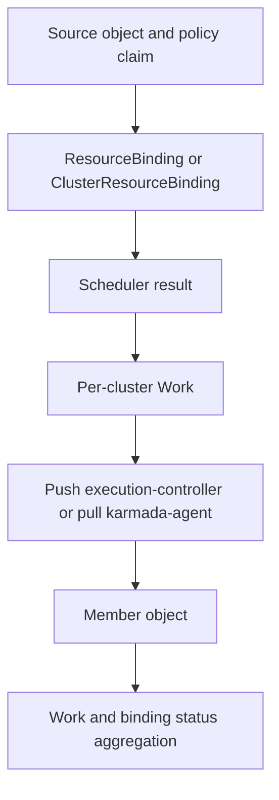

# Placement and propagation evidence

Placement and propagation are related but separate diagnostic surfaces.

## Placement

Policy placement defines candidate filtering and replica strategy. An observed binding records a
scheduler result. To explain that result, correlate the policy generation, binding generation and
conditions, the relevant Cluster snapshot, scheduler configuration, workload replicas and resource
requests, and estimator responses when used.

Current Cluster objects are not proof of the historical snapshot. Cluster names are identifiers, not
country, region, zone, provider, latency, or capacity evidence. Model multi-country and topology
requirements with explicit fields or labels and validate their presence.

## Propagation

Trace incidents in this order:

Stop at the first stage that is failed or lacks evidence. Do not infer later-stage causes from an
earlier missing object. Prefer read-only object, event, and log collection before mutation.
