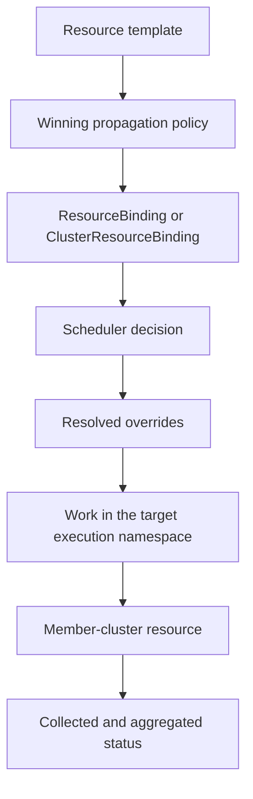

# Karmada Concepts

## Resource template

A resource template is a Kubernetes-native object submitted to the Karmada control plane. It remains
the desired resource template; propagation produces per-cluster delivery artifacts rather than
turning the control plane into an ordinary workload cluster.

## Propagation policy

`PropagationPolicy` and `ClusterPropagationPolicy` select resource templates and define placement.
The namespaced and cluster-scoped policy variants have different selection boundaries. Never treat an
empty propagation resource selector as match-all: current API validation requires at least one
selector to avoid accidental propagation of sensitive resources.

Placement can involve explicit cluster names, cluster labels and fields, ordered affinity groups,
taints and tolerations, spread constraints, replica scheduling, and failover-related behavior. A
policy alone can explain expected candidates, but actual placement may require Cluster state,
ResourceBinding or ClusterResourceBinding, estimator results, and scheduler events.

## Override policy

`OverridePolicy` and `ClusterOverridePolicy` specialize resources for target clusters. Typical uses
include region-specific image registries and provider-specific storage classes. Override selectors
and ordering differ from propagation selectors; do not transfer match-all or ordering rules from one
policy family to the other without checking the API and implementation.

## Propagation object flow

Use this as an investigation map, not as proof that every stage succeeded:

## Multi-region, multi-cluster model

Represent regions, zones, providers, environments, and failure domains as explicit cluster metadata
and placement constraints. Karmada does not infer physical location, latency, legal jurisdiction, or
network connectivity from a cluster name. Validate that labels exist on actual `Cluster` objects and
that spread/failover requirements are satisfiable by the current cluster set.

## Packaged documentation topics

- core-concepts/concepts
- userguide/scheduling/propagation-policy
- userguide/scheduling/override-policy
- userguide/scheduling/cluster-resources
- userguide/failover/failover-analysis
