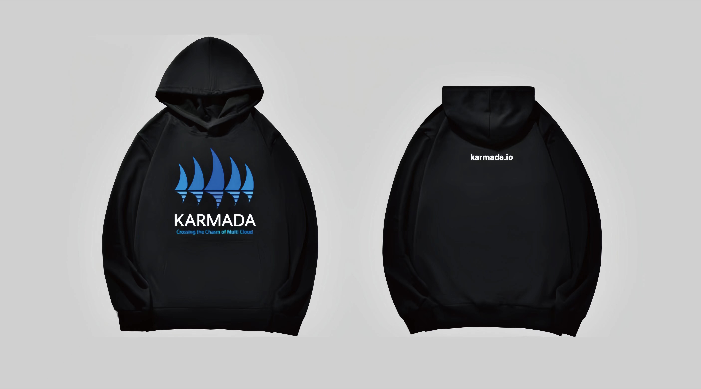
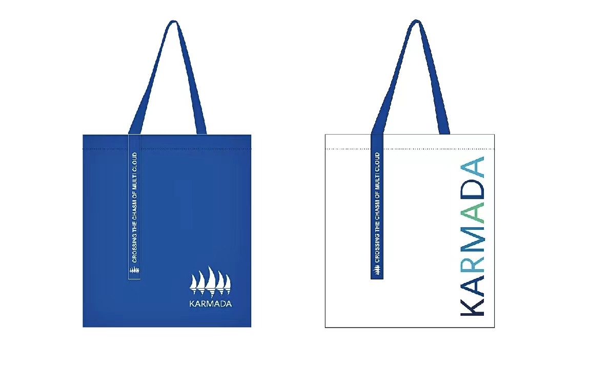
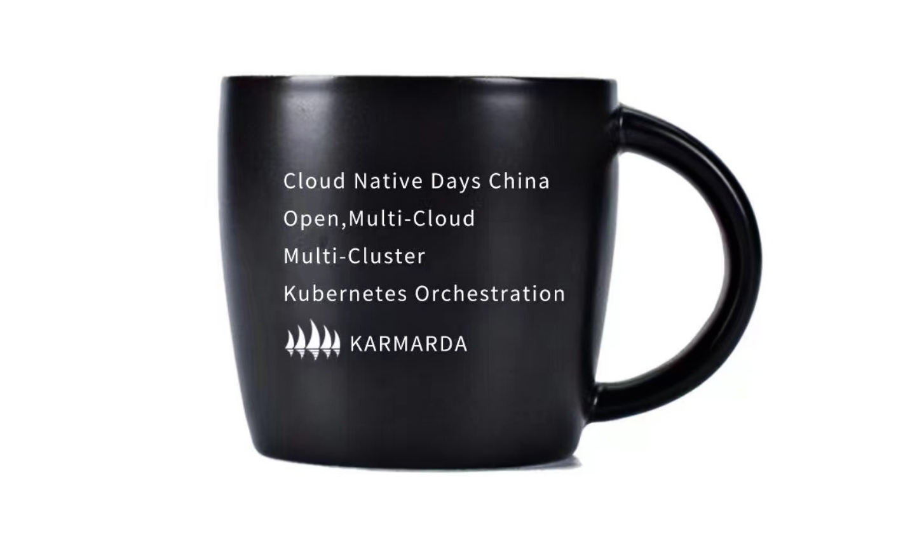

# Swags

## T-shirt

## Hoody

| Size | Chest Width (cm) | Shoulder Width (cm) | Sleeve Length (cm) | Body Length (cm) | Height (cm) | Weight (kg) |
|------|------------------|---------------------|--------------------|------------------|-------------|-------------|
| M    | 56               | 56                  | 51                 | 66               | 160-165     | 100-120     |
| L    | 58               | 58                  | 52                 | 68               | 165-170     | 120-140     |
| XL   | 60               | 60                  | 53                 | 70               | 170-175     | 140-160     |
| 2XL  | 62               | 62                  | 54                 | 72               | 175-180     | 160-170     |
| 3XL  | 64               | 64                  | 55                 | 74               | 180-185     | 170-180     |

## Canvas Bag

## Mug
### Small

### Large

## Sticker

